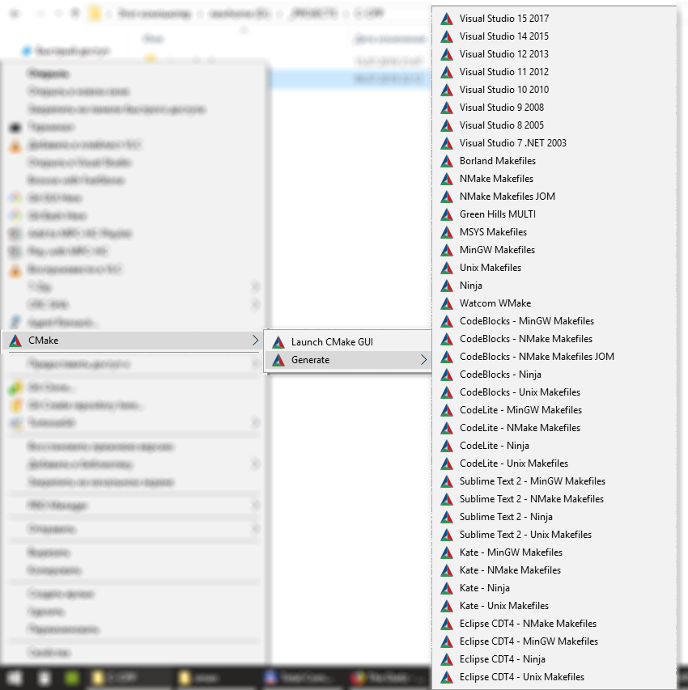
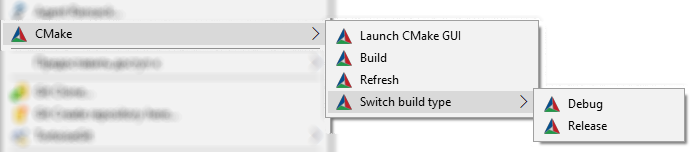
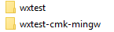

# CmakeShell

Very simple shell extension to make life with CMake easer. Uses [SharpShell](https://github.com/dwmkerr/sharpshell).

## Screenshots

Generate:

Editing cache:

## Installing / Uninstalling

Download the latest release and run install.bat or uninstall.bat

## Usage

cmake.exe must be in PATH.

Right-click the folder containing CMakeLists.txt or CMakeCache.txt and find "CMake" menu (see screenshots).

Generated directory is created at the same level as source directory.

To create project, Shift + Right Click on the project root directory. Basic CMakeLists.txt will be created automatically.
